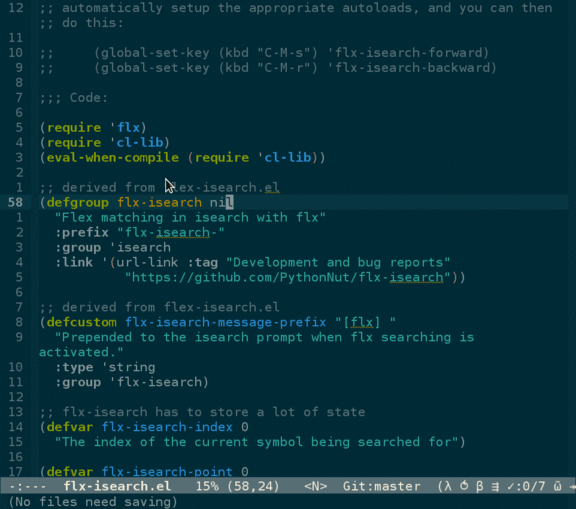

flx-isearch
===========
[](http://melpa.org/#/flx-isearch)

Fuzzy matching is awesome, when done right.

This program lets you isearch for `fiis` and be taken to matches for `flx-isearch-initialize-state`. 
Searches currently only apply to symbols. The input string is flex matched to all symbols in the buffer, 
and all matching symbols are searched one by one.

For example, searching for `fii` in `flx-isearch.el` first takes you to
 * all instances of `flx-isearch-index` one by one
 * all instances of `flx-isearch-initialize-state` one by one
 * all instances of `flx-isearch-lazy-index` one by one
 * [...]
 * all instances of `bounds-of-thing-at-point` one by one

**Obligatory screencast**



The _hope_ is that `flx` will be smart enough to quickly take you to the symbol you're thinking of
with minimal effort. If you don't believe me, I encourage you to try `flx`. It's wonderful,
and extrememly addicting.

Usage
=====

By default, `flx-isearch` does not bind any keys. To use, install from MELPA with `M-x package-install <ret> flx-isearch <ret>`. `package.el` will automatically setup the appropriate autoloads, and you can then do this:

```emacs
(global-set-key (kbd "C-M-s") 'flx-isearch-forward)
(global-set-key (kbd "C-M-r") 'flx-isearch-backward)
```

Bugs
====
Everyone's favorite subject. I'm sure there are some in this code. I'm pretty sure this works on `24.4` and `24.3`, but I don't have a way to test older versions. Issues welcome!

Credits
=======
Flx isearch uses [lewang/**flx**](https://github.com/lewang/flx), a library that uses sophistocated 
heuristics to sort matches. It's awesome. Use it.

This was heavily inspired by 
[emacsmirror/**flex-isearch**](https://github.com/emacsmirror/flex-isearch), 
a cool idea that lacks the intelligent sorting flx provides. Some code has been stolen from that package, especially the code that defines a major mode, as I've never made a major mode before.
